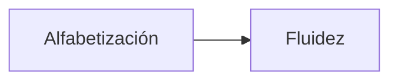
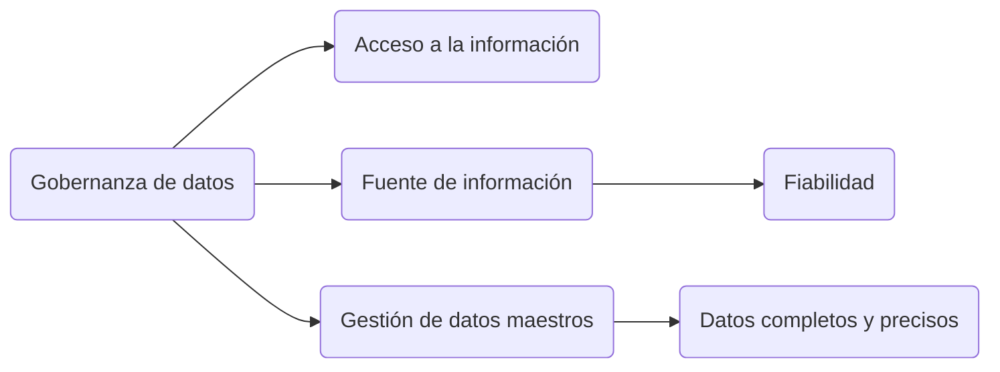
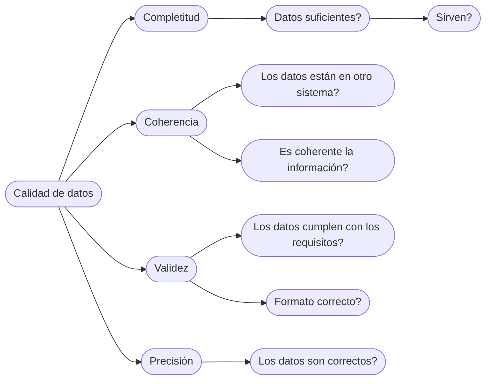

flowchart LR
Start --> Stop

- Alfabetización en datos: Se pueden leer los datos y entenderlos.
- Fluidez de datos: Capacidad de crear algo con datos, no solo saber entenderlos.

**El planteamiento es muy importante**

**Todas las organizaciones deben tener plan de gobernanza de datos**

## Calidad de datos

