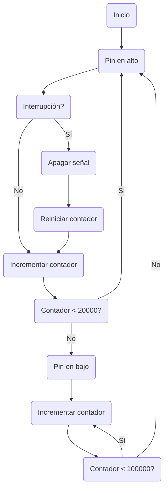

## Conversor ADC

Señal análoga --> Señal discretizada
Periodo de muestreo ->Frecuencia de muestreo

Nyquist: Fs >= 2F
![[Pasted image 20230526073944.png]]

NOTA: PBADEN = OFF apaga las funciones análogas del puerto B
