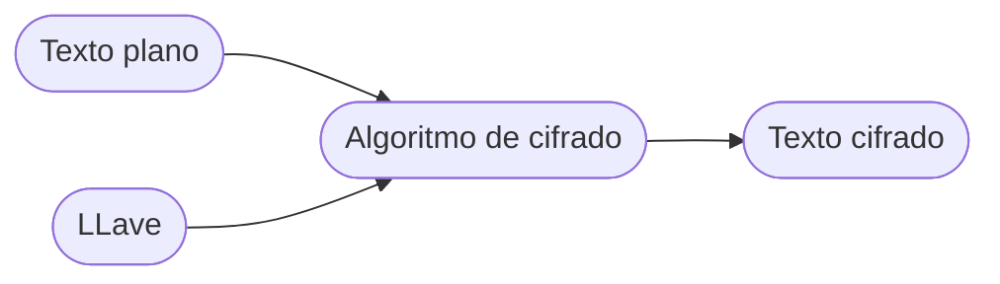

## Introducción Criptografía y  llaves

### Cifrado simétrico

- Misma llave para cifrar y para descifrar.
- Las partes que se quieren comunicar deben acordar llave en común.
- Llave larga para evitar ataque de fuerza bruta.

### Cifrado asimétrico

- Cada usuario tiene una ==pareja de llaves== (no comunes entre usuarios) llamadas: ==llave pública (+)== y ==llave privada (-)==.
- La llave privada solo es conocida por el propietario.
- La llave pública no tiene requerimientos de confidencialidad. Si alguien quiere enviar un mensaje a un usuario, necesita su llave pública.
- Algoritmo más costoso en tiempo de cómputo

==Cifrado con una llave y descifrado con la otra==

