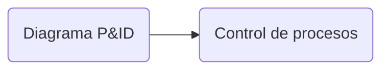

Esquemas utilizados en el campo de la instrumentación y el control(Automatización).

Entender el **proceso**, **instrumentación** usada y cómo están conectados los componentes.

# Simbología

## TAG - Etiqueta

- Cada instrumento o función es identificado con un código alfanumérico.

 ![[Pasted image 20230304170512.png]]

- Etiqueta generalmente común a todos los instrumentos o funciones pertenecientes al mismo lazo.

## Geometría del símbolo

![[Pasted image 20230304170652.png]]
## Funciones

![[Pasted image 20230304170716.png]]

## Conexiones

![[Pasted image 20230304170811.png]]

