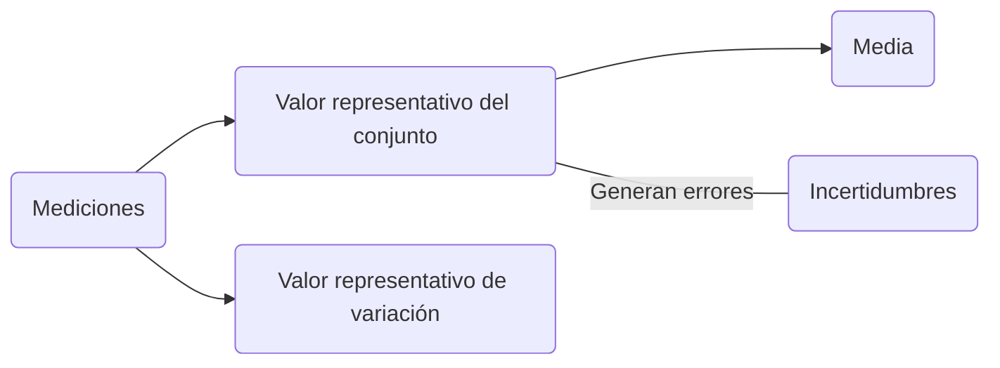
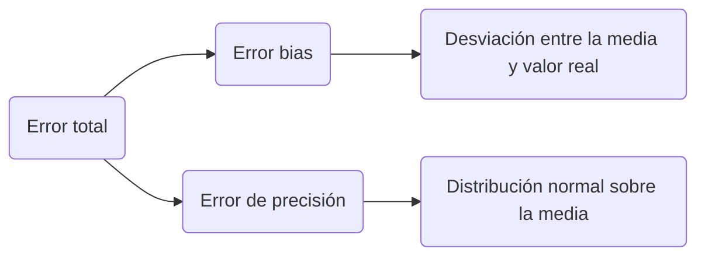

Para un grupo de mediciones realizadas se quiere:

- **Media**: Valor representativo del conjunto de datos.
- **Varianza**: Valor representativo de la variación del conjunto de datos.

## Función de densidad de probabilidad

Determina el valor de tendencia central de una variable entre todos los datos por las diferentes mediciones realizadas.

Frecuencia con la cual la variable medida asume valores particulares en el intervalo alrededor del valor más probable.

## Análisis de regresión

La variable medida comúnmente es función de otra variable controlada.

Para establecer esta relación se utilizan técnicas de aproximación, para obtener la ==tendencia funcional== sin pasar con exactitud por los puntos obtenidos en el muetreo. ^04fc56

#### Por mínimos cuadrados

Se basa en encontrar la mejor función polinomial que aproxime el conjunto de datos de la variable, ==minimizando el cuadrado del error==

Se establece un sistema matricial:
$$\textbf{[A]}x=b$$
- b es el vector de ordenadas de los datos de la medición.
- x es el vector de coeficientes del polinomio que aproxima los datos.
- $\textbf{[A]}$ es la matriz de abscisas que combina las ecuaciones polinomiales de cada pareja ordenada de datos.

El error se calcula como:
$$||[\textbf{A}]x-b||^2$$
Con $[\textbf{A}]$ matriz ==definida positiva==.

## Incertidumbre

En una medición, el ==valor verdadero es desconocido==. 
El análisis de incertidumbre es el proceso de ==identificar y cuantificar errores==, para así reportar datos.

## Errores de medición

^2629fa

**Exactitud**: Diferencia entre el valor real y el medido. Involucra los dos errores. ^8dac42

Fuentes de error:
- Calibración: Error del patrón usado.
- Adquisición de datos: Error del rpoceso de medición.
- Reducción de datos: Error en el uso de correlaciones, truncamientos y resolución.

## Distribución Normal (Gaussiana)

$$ f(x) = \frac{1}{\sigma\sqrt{2\pi}}exp \left [-\frac{(x-\mu)^2}{2\sigma^2} \right ] $$
- x : Magnitud de una medición particular
$$ \bar{x} = \frac{ \sum_{i=1}^{n} x_i }{n}$$
- $\mu$ : Valor medio de la población entera. Promedio de todos los x de la población.
- $\sigma$ : Desviación estándar de la población entera.
$$ \sigma = \sqrt{\frac{ \Sigma d_i^2}{n}}$$

Para datos distribuidos normalmente, alrededor del 50% de todos los casos queda entre los límites de $+0,6745$ y $-0,6745$  a partir de la media.

## Desviación de la media

Si se mide una variable N veces en condiciones fijas se reune un conjunto de valores medios con distribución normal.
$$ x_j = x_a \ \pm \ t_{v,p}S_x(P\%) $$
